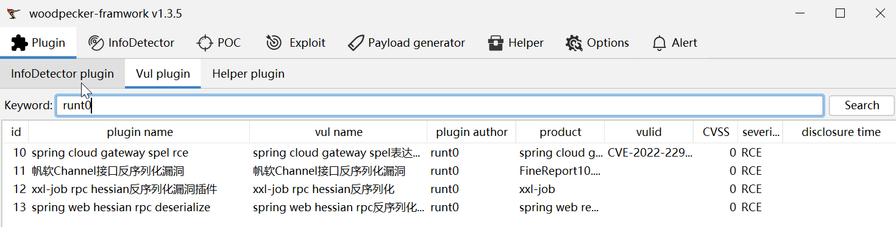
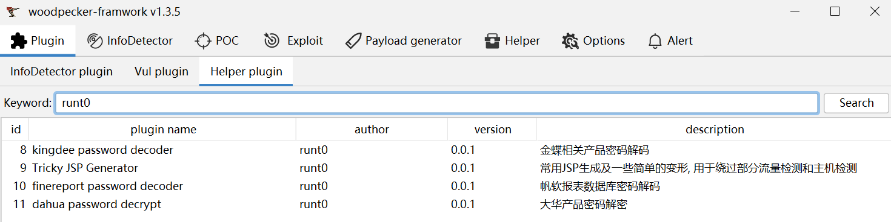

## 0x01 简介

woodpecker-box是一款woodpecker插件, 用于集成一些个人平时遇到的常见漏洞以及漏洞复现过程中顺手编写的自动化利用方法, 方便攻防时提高效率

## 0x02 功能
### detector plugins
- [x] landray oa info detector: session泄露漏洞
- [x] spring actuator info detector: spring端点泄露

***
### vul plugins
- [x] apache activemq openwire exp: 加载远程xml
- [x] 帆软channel反序列化漏洞exp: 远程命令执行回显
- [x] geoserver远程代码执行exp: 内存马注入
- [x] jeecgboot jdbc远程代码执行exp: 加载远程xml文件
- [ ] 帆软V8上传插件漏洞插件
- [ ] 帆软V9任意文件写入漏洞插件
- [x] spring cloud gateway远程代码执行漏洞(CVE-2022-22947)exp: 内存马注入
- [x] xxl-job executor restful api未授权访问exp: 发送jndi请求、反弹ssl-shell
- [x] spring web hessian反序列化漏洞插件exp: 发送jndi请求
- [ ] jolokia logback rce
- [ ] jolokia create rce
- [x] 润乾报表DataSphereServlet接口任意文件上传poc
- [x] 润乾报表DqlServlet接口任意文件上传poc



***

### helper plugins
- [x] 大华ICCC数据库密码解密
- [x] 帆软报表数据库密码解密
- [x] 金蝶EAS数据库密码解密
- [x] spring bean xml生成: 反弹shell
- [x] behinder、suo5 jsp生成: bcel编码
- [x] godzilla从大文件上传请求中还原文件


***

## 0x03 参考
* https://github.com/Rvn0xsy/PassDecode-jar/tree/main
* https://github.com/whwlsfb/cve-2022-22947-godzilla-memshell

## 编译方式
```
mvn clean package assembly:single
```